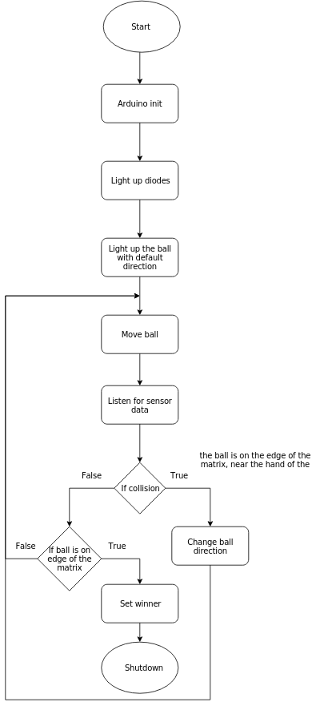

# Проект по “Компютърни архитектури”

### I. Увод

#### 1. Тема
Играта "Pong".

#### 2. История
Играта *Pong*, позната още като *(PONG)*, е една от най-старите аркадни игри и първата спортна аркадна видеоигра. Това е игра от тип тенис, характеризираща се с проста 2D графика. Докато други аркадни видеоигри като *Computer Space* са дошли преди нея, *Pong* е една от първите видео игри, достигнали преобладаваща популярност. Завършена на 29.11.1972 от Алън Алкорн като упражнение, тя бива издадена от [Aтари](https://www.atari.com/) и бързо достига голям успех. Тя е първата търговски успешна аркадна видео игра, което подпомага развитието на индустрията, заедно с първата домашна конзола *Magnavox Odyssey*.

#### 3. Описание

Този проект има за цел да пресъздаде не безизвестната игра Pong във формата на мултиплейър игра (за двама), която се играе на поле, съставено от матрица от светлинни диоди. Имплементацията на играта ще следва правилата на традиционния Pong. 
В полето се пуска топче със зададена скорост и посока. Когато топчето премине границата на полето при един от играчите, 
другият получава една точка. Целта на играчите е с “пръчките” си да отблъснат топчето и да го запратят към полето на противника, така че той да не съумее да го спаси. След получаване на определен брой точки, единият играч бива обявен за победител.

Всеки от играчите ще може с ръка да управлява “пръчката” си. Управлението ще става със сензори, които отчитат позицията на ръката спрямо полето. Самите “пръчки” ще се изобразяват със светодиоди. Със светодиоди също така ще се показва и топчето. През Ардуино ще управляваме логиката за отблъскването на топчето от “пръчките”, преместването им, преместването на топчето, логиката за точките и победата.

Точките на играчите ще се показват отделно и ще се обновяват динамично.

#### 4. Цел и възможности

##### 4.1 Цел
- Да се реализира multiplayer вариант на играта "Pong" за двама играча.
- Всеки да може да управлява “пръчката” си с ръка. 
- Да се запазват и показват точките на двамата играчи.

##### 4.2 Възможности

Изработването на описаната версия на тази игра ще предостави възможност за:
- запознаване със начина, по който създаването на игри се е превърнало в индустрия
- как са се появили различните жанрове и разновидности
- по-обстойно запознаване с embedded програмирането
- изработване и изчисляване на електрически схеми
- практическо приложение и затвърждаване на знанията, придобити преди и по време на курса по "Компютърни архитектури"

#### 5. Задание
- Изграждане на полето за игра като LED матрица.
- Отчитане на движение на ръката на играч.
- Преместване на “пръчката” спрямо положението на ръката.
- Показване на топчето върху полето.
- Отчитане на победа/загуба, когато топчето премине границата на полето в половината на някой играч.
- Отчитане и броене на резултата на играчите.
- Показване на резултатите на играчите.
- Излъчване на победител в играта.

#### 6. Екип

- Ивайло Стефанов Арнаудов 11Б, №13
- Николай Василев Карагьозов 11Б, №22
- Радостин Ангелов Ангелов 11Б, №27
- Христо Езекиев 11А, №28

### II. Проучване

#### 1. Цел на проучването

Да се разучат други проекти със същата тема и да се сравнят реализациите им спрямо нашата.

#### 2. Проекти

##### 1. [Линк](bit.ly/1Z8lbM9)

- В този проект движението на пръчките в играта е реализирано чрез 2 потенциометъра, свързани към Ардуино. С движене на потенциометъра пръчката, която му съответства, се измества нагоре и надолу. 
- Имплементацията на играта е реализирана на езика C. 
- Визуализацията става през телевизор, който е свързан към Ардуино устройството.

###### Сравнение

- При нашия проект движението на пръчките става чрез движение на ръката. То се засича от сензори, който определят позицията на пръчката.
- Имплементацията на играта също е реализирана на езикът C. 
- Визуализацията става през няколко 16 8x8 LED матрици, които показват позицията на топчето.

##### 2. [Линк](http://bit.ly/1VMVel9)

- В този проект движението на пръчките в играта е реализирано чрез 2 потенциометъра, свързани към Ардуино. С движене на потенциометъра пръчката, която му съответства, се измества нагоре и надолу. 
- Имплементацията на играта е реализирана на езика C. 
- Визуализацията става през точно един TFT дисплей.

###### Сравнение

- При нашия проект движението на пръчките става чрез движение на ръката. То се засича от сензори, който определят позицията на пръчката.
- Имплементацията на играта също е реализирана на езикът C. 
- Визуализацията става през 9 бр. 8x8 LED матрици, които показват позицията на топчето.

### III. Принцип на работа

#### 1. Съставни компоненти

Проекта се състои от няколко компонента:
- Arduino Mega 2560
- хардуерен бутон за рестарт на играта
- една голяма 3x3 матрица, която представлява 9 бр. 8x8 LED матрици
- два светодиода, съответно по един за играч, индикиращи победителя в конкретната сесия
- 8 бр. сензори, разделени по 4 за всеки от играчите
- корпус на цялата конструкция

#### 2. Външна конструкция

##### 2.1 Поглед отстрани

##### 2.2 Поглед отгоре

#### 3. Принципна блок схема

### IV. Имплементация

#### 1. Електрическа схема

